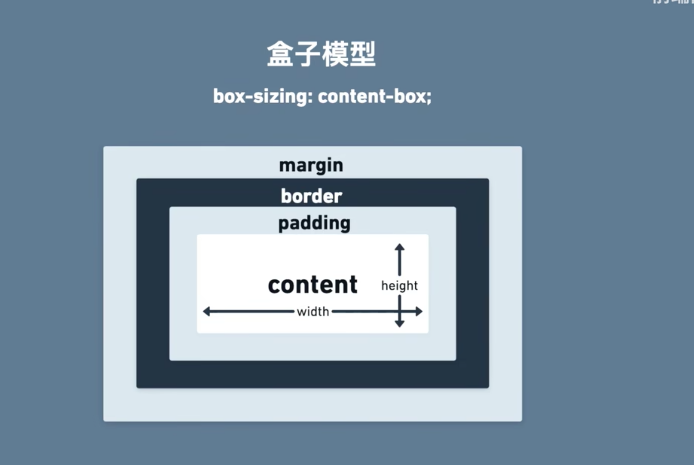
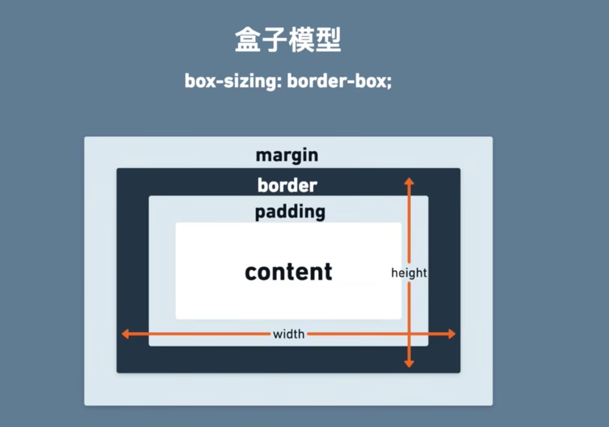
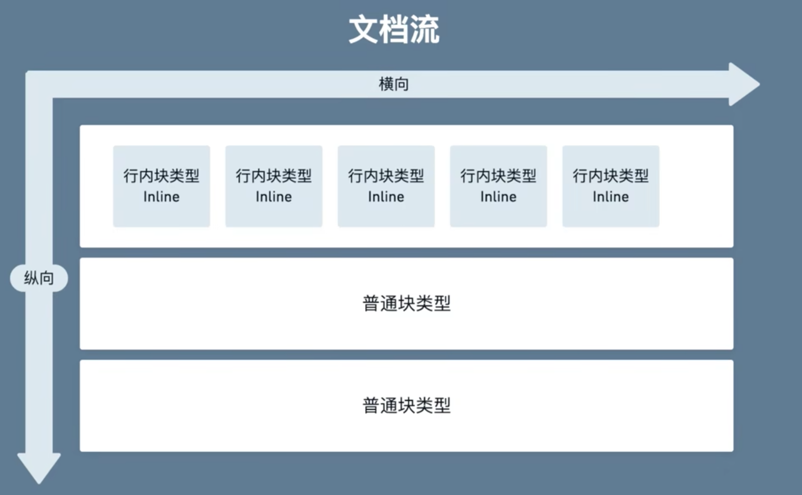
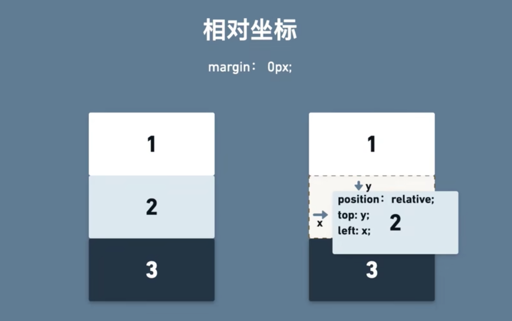
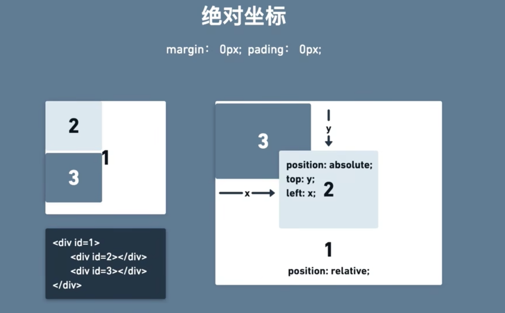
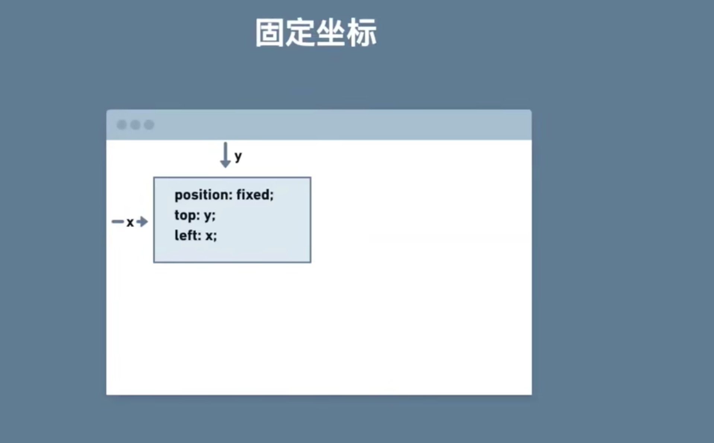
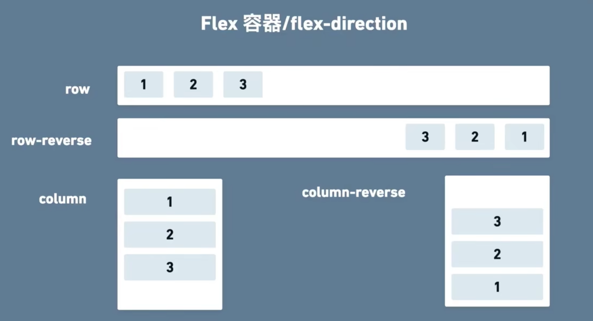
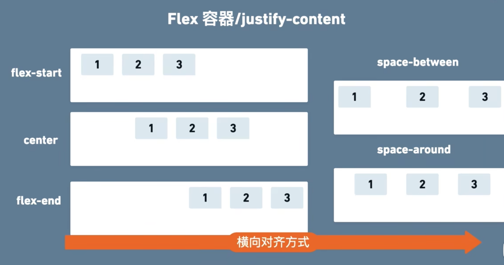
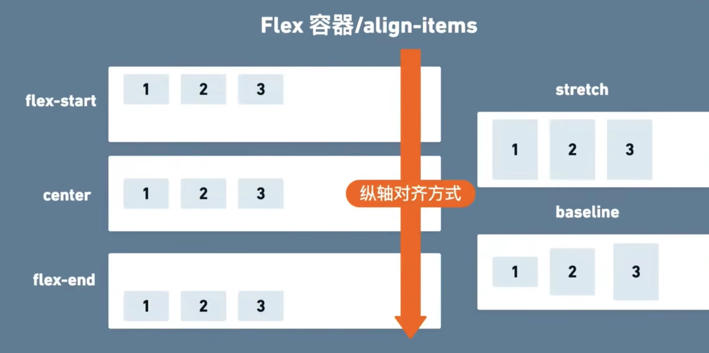
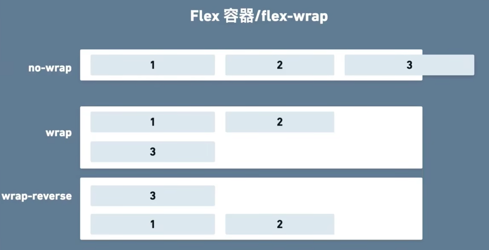

## 盒子模型
### box-sizing:content-box

### box-sizing:border-box


## 文档流


#### [块级元素/block element](https://developer.mozilla.org/zh-CN/docs/Web/HTML/Block-level_elements) 
```html
    <header> //区段头或页头。<footer> //区段尾或页尾。
    <div> //文档分区。<section> //一个页面区段。
    <h1>~<h6> //标题
    <p> //行，表示文本的一个段落。//<article> //文章内容。
    <form> //表单。// <fieldset> //表单元素分组。
    <table> //表格。
    <ol> //有序列表。<ul> //无序列表。
    <hr> //水平分割线。
    <aside> //伴随内容 
    <address> //联系方式信息
```

#### [行内元素/inline element](https://developer.mozilla.org/zh-CN/docs/Web/HTML/Inline_elements)

```html
<button>, <input>, <label>, <select>, <textarea>
<span> //应该在没有其他合适的语义元素时才使用它，通用行内容器，并没有任何特殊语义

<a>
<strong> //表示文本十分重要，一般用粗体显示。
<code> //呈现一段计算机代码

```

## 定位和布局
### 定位
- 坐标定位
- 浮动定位
#### [坐标定位- position](https://developer.mozilla.org/zh-CN/docs/Web/CSS/position)
两个因素：坐标和坐标的参考系

- 静态定位- static：参考系是文档流，提供坐标也无效。默认情况，所有元素是静态定位。
- 相对定位- relative：参考系是自己的文档流位置。即使偏移，也保留文档流中的位置

- 绝对定位- absolute：参考系是最近的非static的父级元素。不保留文档流中的位置。

- 固定定位- fixed：参考系是屏幕视口（viewport），元素的位置在屏幕滚动时不会改变。不保留文档流中的位置。

#### [浮动定位- float](https://developer.mozilla.org/zh-CN/docs/Web/CSS/float)
float CSS 属性指定一个元素应沿其容器的左侧或右侧放置，允许文本和内联元素环绕它。该元素从网页的正常流动（文档流）中移除，但是仍然保持部分的流动性（与绝对定位相反)

- 使用场景：文字和图片。

- 清除浮动

### 布局
- flex布局
- grid布局

#### [flex布局](https://developer.mozilla.org/zh-CN/docs/Web/CSS/CSS_Flexible_Box_Layout/Basic_Concepts_of_Flexbox)
两个元素：父元素&子元素

- 父元素，display：flex
  - flex-direction：主轴的方向

  - justify-content：主轴的对齐

  - align-content：
  - align-items：交叉轴的对齐

  - flex-wrap：处理溢出


- 子元素，flex：flex-grow/flex-shrink/flex-basis
  - flex-grow：扩展
  - flex-shrink：收缩
  - flex-basis：基础长度


#### grid布局


## 参考资料
- [mozilla docs](https://developer.mozilla.org/zh-CN/docs/Web/HTML/Inline_elements)
- [视频总结](https://www.bilibili.com/video/BV1qP411j74g/?spm_id_from=333.999.0.0&vd_source=22af953ea4c09540ad1966711a2d53f0)
- [HTML标签常用总结](https://juejin.cn/post/6844903896654020622#heading-23)