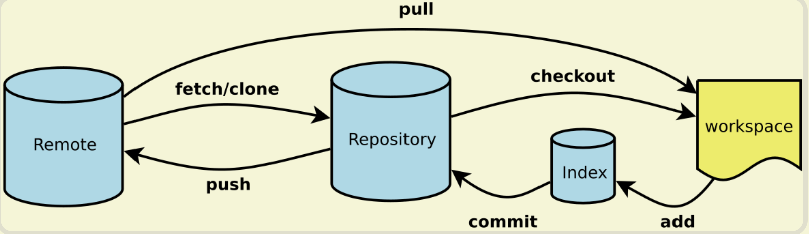
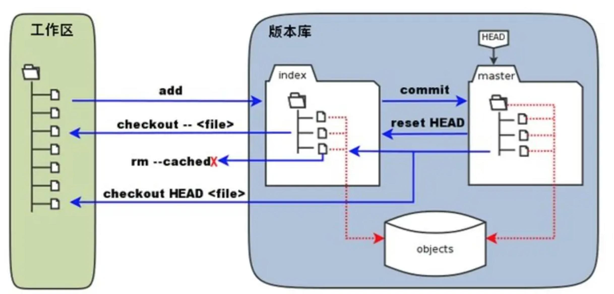
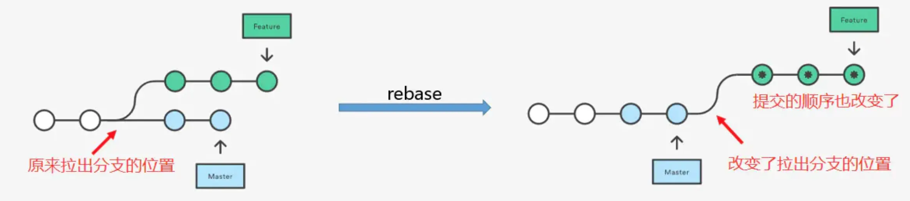

## 工作流程及原理

### Git 的工作流程：



- workspace(工作区):
  本地电脑存放项目文件的地方，我们平时开发写的代码也是在这个区进行的；
- Index / Stage(暂存区):
  暂时存放文件的地方，通过 add 命令可以将工作区的文件添加到暂存区内；
- Repository(本地仓库):
  .git 文件夹里还包括 git 自动创建的 master 分支，并且将 HEAD 指针指向 master 分支。使用 commit 命令可以将暂存区中的文件添加到本地仓库中；
- Remote(远程仓库):
  项目代码在远程 git 服务器上，通常使用 clone 命令将远程仓库拷贝到本地仓库中，开发后通过 push 推送到远程仓库中；



## Git 基本操作

### git add

添加文件到暂存区

```bash
# 添加某个文件到暂存区，后面可以跟多个文件，以空格区分
git add xxx
# 添加当前更改的所有文件到暂存区。
git add .
```

### git commit

```bash
# 提交暂存的更改，会新开编辑器进行编辑
git commit
# 提交暂存的更改，并记录下备注
git commit -m "you message"
# 等同于 git add . && git commit -m
git commit -am
# 对最近一次的提交的信息进行修改,此操作会修改commit的hash值
git commit --amend

```

### git pull

```bash
# 从远程仓库拉取代码并合并到本地，可简写为 git pull 等同于 git fetch && git merge
git pull <远程主机名> <远程分支名>:<本地分支名>
# 使用rebase的模式进行合并
git pull --rebase <远程主机名> <远程分支名>:<本地分支名>

```

### git fetch

与 git pull 不同的是: git fetch **仅仅只会拉取远程的更改，不会自动进行 merge 操作。对你当前的代码没有影响**

```bash
# 获取远程仓库特定分支的更新
git fetch <远程主机名> <分支名>
# 获取远程仓库所有分支的更新
git fetch --all
```

### git branch

```bash
##### 增
# 新建一个分支，但依然停留在当前分支
$ git branch [branch-name]
# 新建一个分支，并切换到该分支
$ git checkout -b [branch-name]
# 新建一个分支，指向指定commit
$ git branch [branch-name] [commit]
# 新建一个分支，与指定的远程分支建立追踪关系
$ git branch --track [branch-name] [remote-branch]

##### 删
# 删除本地分支
git branch -d <branch-nane>

##### 改
# 重新命名分支
git branch -m <old-branch-name> <new-branch-name>

##### 查
# 查看本地分支
git branch
# 查看远程分支
git branch -r
# 查看本地和远程分支
git branch -a

##### 合并
# 合并指定分支到当前分支
$ git merge [branch]
# 选择一个commit，合并进当前分支
$ git cherry-pick [commit]

##### 切换
# 切换到指定分支，并更新工作区
$ git checkout [branch-name]
# 切换到上一个分支
$ git checkout -

##### 远程操作
# 建立追踪关系，在现有分支与指定的远程分支之间
$ git branch --set-upstream [branch] [remote-branch]
# 删除远程分支
$ git push origin --delete [branch-name]
$ git branch -dr [remote/branch]


```

## 工作中使用 Git 解决问题的场景

### git rebase 让你的提交记录更加清晰可读

#### git rebase 的使用

rebase(变基)，作用和 merge 很相似，用于把一个分支的修改合并到当前分支上。

如下图所示，下图介绍了经过 rebase 后提交历史的变化情况。



###

###

###

###

## 参考资料

- [常用 Git 命令清单](https://www.ruanyifeng.com/blog/2015/12/git-cheat-sheet.html)
- [我在工作中是如何使用 git 的](https://juejin.cn/post/6974184935804534815#heading-20)

- [all-about-git](https://gitee.com/all-about-git)
- [Git 常用命令总结](https://www.freecodecamp.org/chinese/news/collection-of-useful-git-commands/)
- [一份前端老菜鸟的 Git 总结](https://juejin.cn/post/7028459321667092488)
