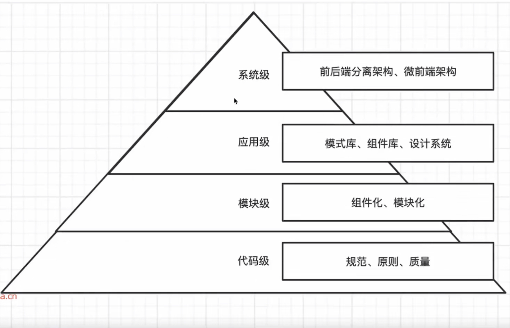

## 前端架构层次设计

## UI设计思想/原则/规范

### 色彩 

- 主题色：primary

应用场景包括：关键行动点，操作状态、重要信息高亮，图形化等场景（[参考](https://ant.design/docs/spec/colors-cn#%E5%93%81%E7%89%8C%E8%89%B2%E7%9A%84%E5%BA%94%E7%94%A8)）

- 功能色：success、danger、warning、info
- 中性色：包含黑、白、灰。常规的页面显示和过度，浅色和深色的对比

### 
